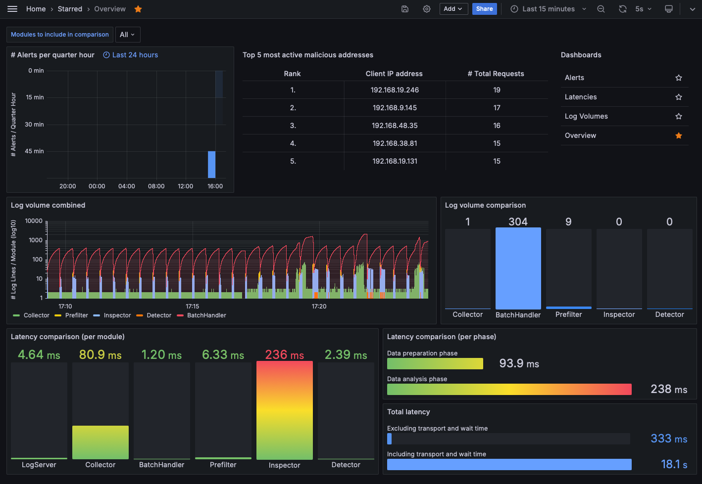
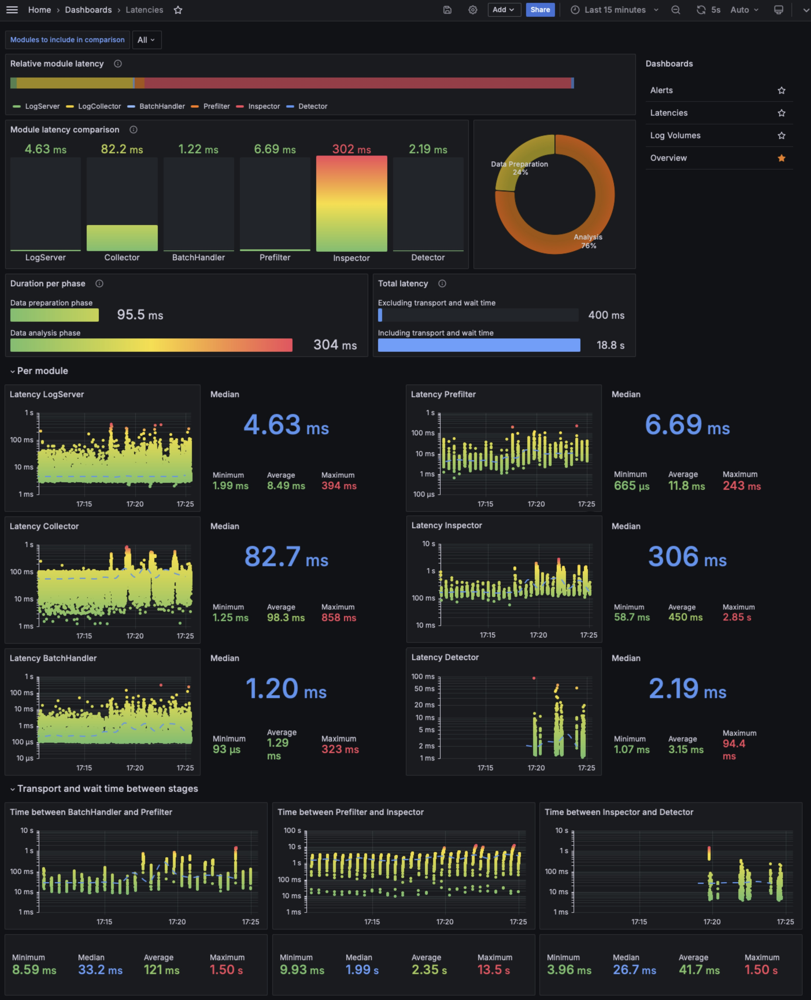
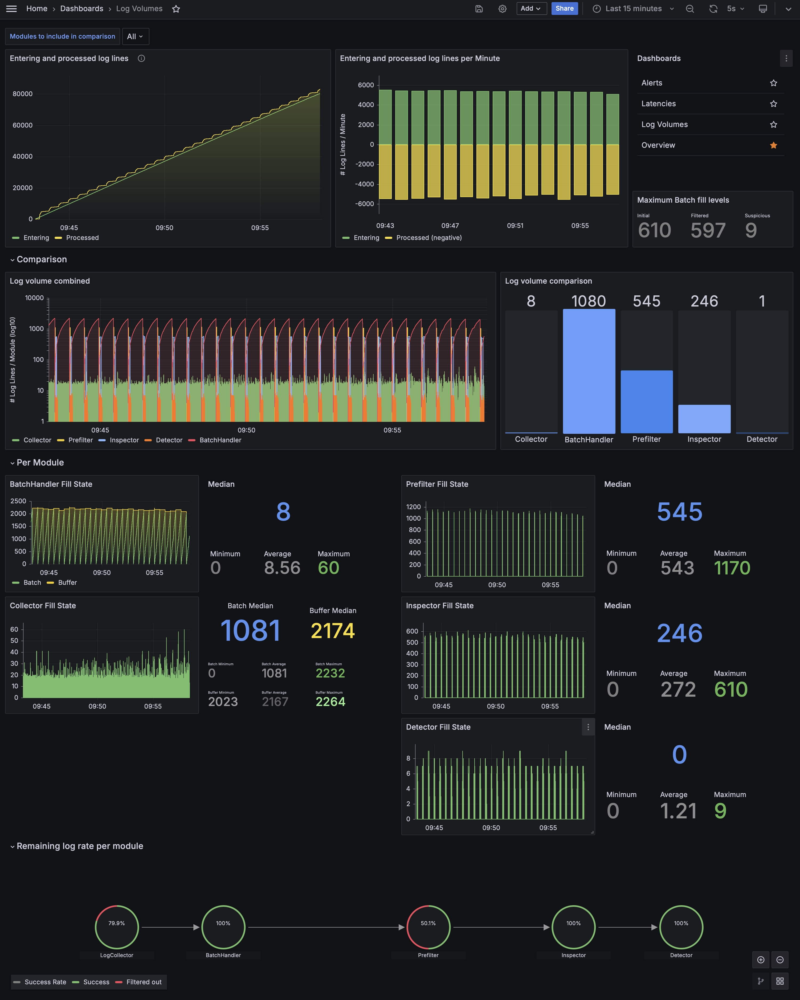
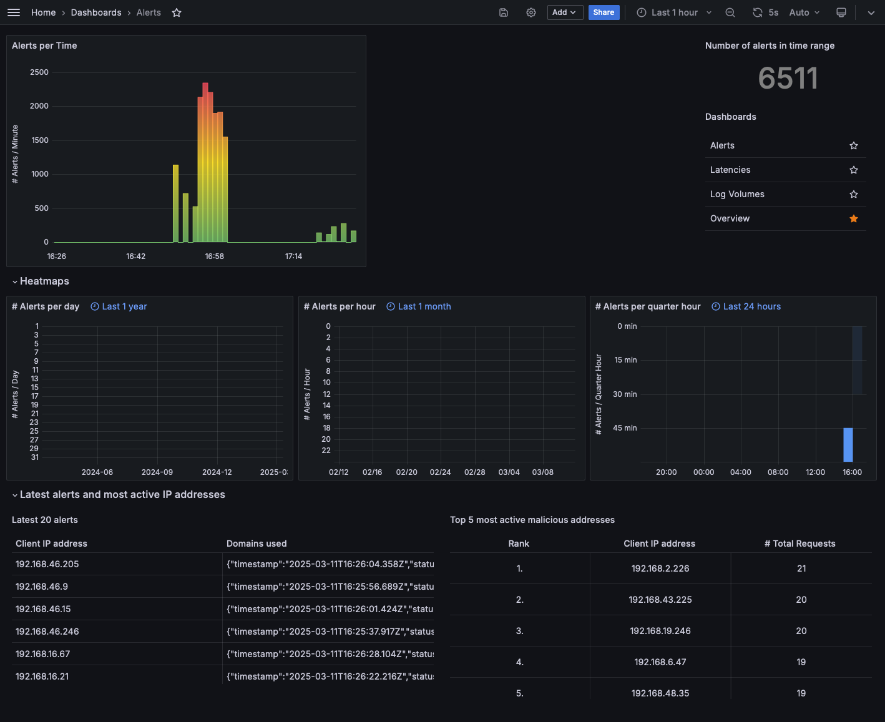
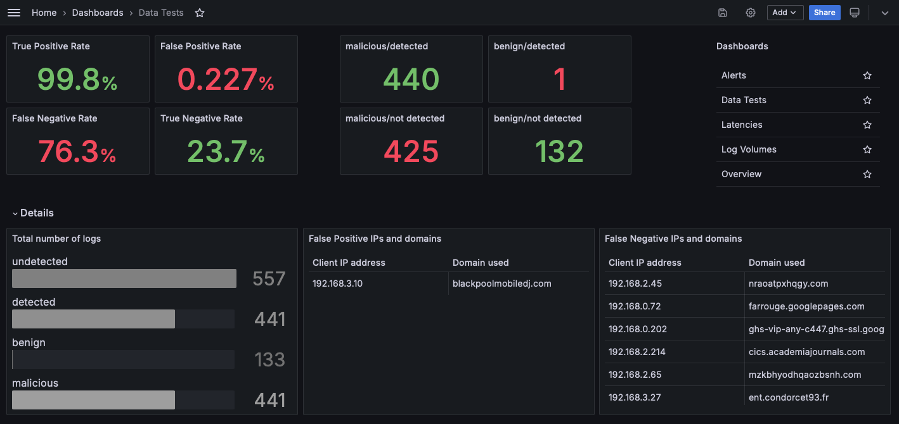

<a id="readme-top"></a>

<!-- PROJECT SHIELDS -->
<div align="center">

[![Codecov Coverage][coverage-shield]][coverage-url]
[![Contributors][contributors-shield]][contributors-url]
[![Forks][forks-shield]][forks-url]
[![Stargazers][stars-shield]][stars-url]
[![Issues][issues-shield]][issues-url]
[![EUPL License][license-shield]][license-url]


</div>

<!-- PROJECT LOGO -->
<br />
<div align="center">
  <a href="https://github.com/stefanDeveloper/heiDGAF">
    
  </a>

<h3 align="center">heiDGAF - Domain Generation Algorithms Finder</h3>

  <p align="center">
    Machine learning-based DNS classifier for detecting Domain Generation Algorithms (DGAs), tunneling, and data exfiltration by malicious actors.
    <br />
    <a href="https://heidgaf.readthedocs.io/en/latest/"><strong>Explore the docs »</strong></a>
    <br />
    <br />
    <a href="https://mybinder.org/v2/gh/stefanDeveloper/heiDGAF-tutorials/HEAD?labpath=demo_notebook.ipynb">View Demo</a>
    ·
    <a href="https://github.com/stefanDeveloper/heiDGAF/issues/new?labels=bug&template=bug-report---.md">Report Bug</a>
    ·
    <a href="https://github.com/stefanDeveloper/heiDGAF/issues/new?labels=enhancement&template=feature-request---.md">Request Feature</a>
  </p>
</div>

> [!CAUTION]
> The project is under active development right now. Everything might change, break, or move around quickly.

<table>
<tr>
  <td><b>Continuous Integration</b></td>
  <td>
    <a href="https://github.com/stefanDeveloper/heiDGAF/actions/workflows/build_test_linux.yml">
    
    </a>
    <a href="https://github.com/stefanDeveloper/heiDGAF/actions/workflows/build_test_macos.yml">
    
    </a>
    <a href="https://github.com/stefanDeveloper/heiDGAF/actions/workflows/build_test_windows.yml">
    
    </a>
  </td>
</tr>
</table>

## About the Project


## Getting Started

If you want to use heiDGAF, just use the provided Docker compose to quickly bootstrap your environment:

```
docker compose -f docker/docker-compose.yml up
```
<p align="center">
  
</p>

## Examplary Dashboards
In the below summary you will find examplary views of the grafana dashboards. The metrics were obtained using the [mock-generator](./docker/docker-compose.send-real-logs.yml)
<details>
  <summary>📊 <strong>Overview Dashboard</strong></summary>

  <p align="center">
    <a href="./assets/readme_assets/overview.png">
      
    </a>
  </p>

</details>

<details>
  <summary>📈 <strong>Latencies Dashboard</strong></summary>

  <p align="center">
    <a href="./assets/readme_assets/latencies.jpeg">
      
    </a>
  </p>

</details>

<details>
  <summary>📉 <strong>Log Volumes Dashboard</strong></summary>

  <p align="center">
    <a href="./assets/readme_assets/log_volumes.jpeg">
      
    </a>
  </p>

</details>

<details>
  <summary>🚨 <strong>Alerts Dashboard</strong></summary>

  <p align="center">
    <a href="./assets/readme_assets/alerts.png">
      
    </a>
  </p>

</details>

<details>
  <summary>🧪 <strong>Dataset Dashboard</strong></summary>

  <p align="center">
    <a href="./assets/readme_assets/datatests.png">
      
    </a>
  </p>

</details>


### Developing

Install all Python requirements:

```sh
python -m venv .venv
source .venv/bin/activate

sh install_requirements.sh
```

Alternatively, you can use `pip install` and enter all needed requirements individually with `-r requirements.*.txt`.

Now, you can start each stage, e.g. the inspector:

```sh
python src/inspector/main.py
```
<p align="right">(<a href="#readme-top">back to top</a>)</p>

### Configuration

The following table lists the most important configuration parameters with their respective default values.
The full list of configuration parameters is available at the [documentation](https://heidgaf.readthedocs.io/en/latest/usage.html)

| Path                                       | Description                                                                 | Default Value                                                                                                |
| :----------------------------------------- | :-------------------------------------------------------------------------- | :----------------------------------------------------------------------------------------------------------- |
| `pipeline.data_inspection.inspector.mode`  | Mode of operation for the data inspector.                                   | `univariate` (options: `multivariate`, `ensemble`)                                                           |
| `pipeline.data_inspection.inspector.ensemble.model` | Model to use when inspector mode is `ensemble`.                             | `WeightEnsemble`                                                                                             |
| `pipeline.data_inspection.inspector.ensemble.module` | Module name for the ensemble model.                                       | `streamad.process`                                                                                           |
| `pipeline.data_inspection.inspector.models` | List of models to use for data inspection (e.g., anomaly detection).      | Array of model definitions (e.g., `{"model": "ZScoreDetector", "module": "streamad.model", "model_args": {"is_global": false}}`)|
| `pipeline.data_inspection.inspector.anomaly_threshold` | Threshold for classifying an observation as an anomaly.                     | `0.01`                                                                                                     |
| `pipeline.data_analysis.detector.model`    | Model to use for data analysis (e.g., DGA detection).                       | `rf` (Random Forest) option: `XGBoost`                                                    |
| `pipeline.data_analysis.detector.checksum` | Checksum for the model file to ensure integrity.                            | `021af76b2385ddbc76f6e3ad10feb0bb081f9cf05cff2e52333e31040bbf36cc`                                       |
| `pipeline.data_analysis.detector.base_url` | Base URL for downloading the model if not present locally.                  | `https://heibox.uni-heidelberg.de/d/0d5cbcbe16cd46a58021/`                                                  |

<p align="right">(<a href="#readme-top">back to top</a>)</p>

### Insert test data

>[!IMPORTANT]
> To be able to train and test our or your own models, you will need to download the datasets.

For training our models, we currently rely on the following data sets:
- [CICBellDNS2021](https://www.unb.ca/cic/datasets/dns-2021.html)
- [DGTA Benchmark](https://data.mendeley.com/datasets/2wzf9bz7xr/1)
- [DNS Tunneling Queries for Binary Classification](https://data.mendeley.com/datasets/mzn9hvdcxg/1)
- [UMUDGA - University of Murcia Domain Generation Algorithm Dataset](https://data.mendeley.com/datasets/y8ph45msv8/1)
- [Real-CyberSecurity-Datasets](https://github.com/gfek/Real-CyberSecurity-Datasets/)

However, we compute all feature separately and only rely on the `domain` and `class`.
Currently, we are only interested in binary classification, thus, the `class` is either `benign` or `malicious`.

After downloading the dataset and storing it under `<project-root>/data` you can run
```
docker compose -f docker/docker-compose.send-real-logs.yml up
```
to start inserting the dataset traffic.

<p align="right">(<a href="#readme-top">back to top</a>)</p>


### Train your own models
> [!IMPORTANT]
> This is only a brief wrap-up of a custom training process.
> We highly encourage you to have a look at the [documentation](https://heidgaf.readthedocs.io/en/latest/training.html)
> for a full description and explanation of the configuration parameters.

Currently, we feature two trained models, namely XGBoost and RandomForest.

```sh
python -m venv .venv
source .venv/bin/activate

pip install -r requirements/requirements.train.txt
```

After setting up the [dataset directories](#insert-test-data) (and adding the code for your model class if applicable), you can start the training process by running the following commands:

**Model Training**
```
python src/train/train.py train  --dataset <dataset_type> --dataset_path <path/to/your/datasets> --model <model_name>
```
The results will be saved per default to `./results`, if not configured otherwise. <br>

**Model Tests**
```
python src/train/train.py test  --dataset <dataset_type> --dataset_path <path/to/your/datasets> --model <model_name> --model_path <path_to_model_version>
```

**Model Explain**
```
python src/train/train.py explain  --dataset <dataset_type> --dataset_path <path/to/your/datasets> --model <model_name> --model_path <path_to_model_version>
```
This will create a rules.txt file containing the innards of the model, explaining the rules it created.

<p align="right">(<a href="#readme-top">back to top</a>)</p>


### Data

> [!IMPORTANT]
> We support custom schemes.

Depending on your data and usecase, you can customize the data scheme to fit your needs.
The below configuration is part of the [main configuration file](./config.yaml) which is detailed in our [documentation](https://heidgaf.readthedocs.io/en/latest/usage.html#id2)

```yml
loglines:
  fields:
    - [ "timestamp", RegEx, '^\d{4}-\d{2}-\d{2}T\d{2}:\d{2}:\d{2}\.\d{3}Z$' ]
    - [ "status_code", ListItem, [ "NOERROR", "NXDOMAIN" ], [ "NXDOMAIN" ] ]
    - [ "src_ip", IpAddress ]
    - [ "dns_server_ip", IpAddress ]
    - [ "domain_name", RegEx, '^(?=.{1,253}$)((?!-)[A-Za-z0-9-]{1,63}(?<!-)\.)+[A-Za-z]{2,63}$' ]
    - [ "record_type", ListItem, [ "A", "AAAA" ] ]
    - [ "response_ip", IpAddress ]
    - [ "size", RegEx, '^\d+b$' ]
```


<p align="right">(<a href="#readme-top">back to top</a>)</p>

<!-- CONTRIBUTING -->
## Contributing

Contributions are what make the open source community such an amazing place to learn, inspire, and create. Any
contributions you make are **greatly appreciated**.

If you have a suggestion that would make this better, please fork the repo and create a pull request. You can also
simply open an issue with the tag "enhancement".
Don't forget to give the project a star! Thanks again!

### Top contributors:

<a href="https://github.com/stefanDeveloper/heiDGAF/graphs/contributors">
  
</a>


<p align="right">(<a href="#readme-top">back to top</a>)</p>

<!-- LICENSE -->

## License

Distributed under the EUPL License. See `LICENSE.txt` for more information.

<p align="right">(<a href="#readme-top">back to top</a>)</p>


<!-- MARKDOWN LINKS & IMAGES -->
<!-- https://www.markdownguide.org/basic-syntax/#reference-style-links -->

[contributors-shield]: https://img.shields.io/github/contributors/stefanDeveloper/heiDGAF.svg?style=for-the-badge

[contributors-url]: https://github.com/stefanDeveloper/heiDGAF/graphs/contributors

[forks-shield]: https://img.shields.io/github/forks/stefanDeveloper/heiDGAF.svg?style=for-the-badge

[forks-url]: https://github.com/stefanDeveloper/heiDGAF/network/members

[stars-shield]: https://img.shields.io/github/stars/stefanDeveloper/heiDGAF.svg?style=for-the-badge

[stars-url]: https://github.com/stefanDeveloper/heiDGAF/stargazers

[issues-shield]: https://img.shields.io/github/issues/stefanDeveloper/heiDGAF.svg?style=for-the-badge

[issues-url]: https://github.com/stefanDeveloper/heiDGAF/issues

[license-shield]: https://img.shields.io/github/license/stefanDeveloper/heiDGAF.svg?style=for-the-badge

[license-url]: https://github.com/stefanDeveloper/heiDGAF/blob/master/LICENSE.txt

[coverage-shield]: https://img.shields.io/codecov/c/github/stefanDeveloper/heiDGAF?style=for-the-badge

[coverage-url]: https://app.codecov.io/github/stefanDeveloper/heiDGAF
