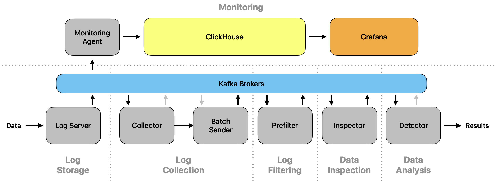

Monitoring
~~~~~~~~~~

.. note::

   This page is under active development.

Overview
========

The software includes a monitoring functionality that stores relevant information in a database (`ClickHouse`). The
collected data is then visualized using multiple `Grafana` dashboard views.

Setup
=====

Normal mode
-----------

Both, `ClickHouse` and `Grafana` can be executed as their own Docker container. All needed containers are started
when executing:

.. code-block:: console

   $ docker compose -f docker/docker-compose.yml up

All modules send their monitoring-relevant information to Kafka, from which it is then collected by the
`Monitoring Agent` module. This module checks their validity and resumes by storing the values in `ClickHouse`. By the
default configuration defined in ``docker-compose.yml``, `Grafana` automatically loads the dashboard views and fills
them with the data in `ClickHouse`. The dashboard views can then be observed on ``localhost:3000`` (by default).

`Datatest` mode
---------------

For users interested in testing their own machine learning models used by the detection algorithm in the `Data Analysis`
stage, the monitoring functionality can be started in the `datatest` mode:

.. code-block:: console

   $ docker compose -f docker/docker-compose.datatests.yml up

`Grafana` then shows one more dashboard view, `Datatests`, that shows the confusion matrix for a testing dataset.

.. warning::

   This feature is in an early development stage!
