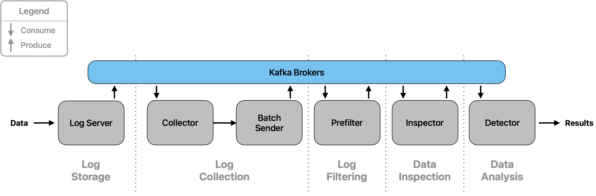

Pipeline
~~~~~~~~

Overview
========

The core component of the software's architecture is its data pipeline. It consists of five stages/modules, and data
traverses through it using Apache Kafka.

Stage 1: Log Storage
====================

This stage serves as the central contact point for all data.

Overview
--------

The :class:`LogServer` class is the core component of this stage. It reads from several input sources and sends the
data to Kafka, where it can be obtained by the following module.

Main Class
----------

.. py:currentmodule:: src.logserver.server
.. autoclass:: LogServer

Usage and configuration
-----------------------

Currently, the :class:`LogServer` reads from both an input file and a Kafka topic, simultaneously. The configuration
allows changing the file name to read from.

- **Without Docker**:

  - To change the input file path, change ``pipeline.log_storage.logserver.input_file`` in the `config.yaml`. The
    default setting is ``"/opt/file.txt"``.

- **With Docker**:

  - Docker mounts the file specified in ``MOUNT_PATH`` in the file `docker/.env`. By default, this is set to
    ``../../default.txt``, which refers to the file `docker/default.txt`.
  - By changing this variable, the file to be mounted can be set. Please note that in this case, the variable specified
    in the `config.yaml` must be set to the default value.

Stage 2: Log Collection
=======================

The `Log Collection` stage is responsible for retrieving loglines from the :ref:`Log Storage<Stage 1: Log Storage>`,
parsing their information fields, and validating the data. Each field is checked to ensure it is of the correct type
and format. This stage ensures that all data is accurate, reducing the need for further verification in subsequent
stages. Any loglines that do not meet the required format are immediately discarded to maintain data integrity. Valid
loglines are then buffered and transmitted in batches after a pre-defined timeout or when the buffer reaches its
capacity. This minimizes the number of messages sent to the next stage and optimizes performance. The client's IP
address is retrieved from the logline and used to create the ``subnet_id`` with the number of subnet bits specified in
the configuration. The functionality of the buffer is detailed in the subsection, :ref:`Buffer Functionality`.

Overview
--------

The `Log Collection` stage comprises three main classes:

1. :class:`LogCollector`: Connects to the :class:`LogServer` to retrieve and parse loglines, validating their format
   and content. Adds ``subnet_id`` that it retrieves from the client's IP address in the logline.
2. :class:`BufferedBatch`: Buffers validated loglines with respect to their ``subnet_id``. Maintains the timestamps for
   accurate processing and analysis per key (``subnet_id``). Returns sorted batches.
3. :class:`CollectorKafkaBatchSender`: Adds messages to the data structure :class:`BufferedBatch`, maintains the timer
   and checks the fill level of the key-specific batches. Sends the key's batches if full, sends all batches at timeout.

Main Classes
------------

.. py:currentmodule:: src.logcollector.collector
.. autoclass:: LogCollector

.. py:currentmodule:: src.logcollector.batch_handler
.. autoclass:: BufferedBatch

.. py:currentmodule:: src.logcollector.batch_handler
.. autoclass:: CollectorKafkaBatchSender

Usage
-----

LogCollector
............

The :class:`LogCollector` connects to the :class:`LogServer` to retrieve one logline, which it then processes and
validates. The logline is parsed into its respective fields, each checked for correct type and format:

- **Field Validation**:

  - Checks include data type verification and value range checks (e.g., verifying that an IP address is valid).
  - Only loglines meeting the criteria are forwarded to the :class:`CollectorKafkaBatchSender`.

- **Subnet Identification**:

  - The configuration file specifies the number n of bits in a subnet (e.g. 24). The client's IP address serves as a
    base for the ``subnet_id``. For this, the initial IP address is cut off after n bits, the rest is filled with
    zeros, and ``_n`` is added to the end of the ``subnet_id``. For example:

    +------------------------+------------------------------------------------+
    | **Client IP address**  | **Subnet ID**                                  |
    +========================+================================================+
    | ``171.154.4.17``       | ``171.154.4.0_24``                             |
    +------------------------+------------------------------------------------+

- **Connection to LogServer**:

  - The :class:`LogCollector` establishes a connection to the :class:`LogServer` and retrieves loglines when they
    become available.

- **Log Line Format**:

  - By default, log lines have the following format:

    .. code-block::

        TIMESTAMP STATUS SRC_IP DNS_IP HOST_DOMAIN_NAME RECORD_TYPE RESPONSE_IP SIZE

    +----------------------+------------------------------------------------+
    | **Field**            | **Description**                                |
    +======================+================================================+
    | ``TIMESTAMP``        | The date and time when the log entry was       |
    |                      | recorded. Formatted as                         |
    |                      | ``YYYY-MM-DDTHH:MM:SS.sssZ``.                  |
    |                      |                                                |
    |                      | - **Format**: ``%Y-%m-%dT%H:%M:%S.%f`` (with   |
    |                      |   microseconds truncated to milliseconds).     |
    |                      | - **Time Zone**: ``Z``                         |
    |                      |   indicates Zulu time (UTC).                   |
    |                      | - **Example**: ``2024-07-28T14:45:30.123Z``    |
    |                      |                                                |
    |                      | This format closely resembles ISO 8601, with   |
    |                      | milliseconds precision.                        |
    +----------------------+------------------------------------------------+
    | ``STATUS``           | The status of the DNS query, e.g., ``NOERROR``,|
    |                      | ``NXDOMAIN``.                                  |
    +----------------------+------------------------------------------------+
    | ``SRC_IP``        | The IP address of the client that made the     |
    |                      | request.                                       |
    +----------------------+------------------------------------------------+
    | ``DNS_IP``           | The IP address of the DNS server processing    |
    |                      | the request.                                   |
    +----------------------+------------------------------------------------+
    | ``HOST_DOMAIN_NAME`` | The domain name being queried.                 |
    +----------------------+------------------------------------------------+
    | ``RECORD_TYPE``      | The type of DNS record requested, such as ``A``|
    |                      | or ``AAAA``.                                   |
    +----------------------+------------------------------------------------+
    | ``RESPONSE_IP``      | The IP address returned in the DNS response.   |
    +----------------------+------------------------------------------------+
    | ``SIZE``             | The size of the DNS query response in bytes.   |
    |                      | Represented in the format like ``150b``, where |
    |                      | the number indicates the size and ``b`` denotes|
    |                      | bytes.                                         |
    +----------------------+------------------------------------------------+

  - Users can change the format and field types, as described in the :ref:`Logline format configuration` section.

BufferedBatch
.............

The :class:`BufferedBatch` manages the buffering of validated loglines as well as their timestamps:

- **Batching Logic and Buffering Strategy**:

  - Collects log entries into a ``batch`` dictionary, with the ``subnet_id`` as key.
  - Uses a ``buffer`` per key to concatenate and send both the current and previous batches together.
  - This approach helps detect errors or attacks that may occur at the boundary between two batches when analyzed in
    :ref:`Stage 4: Data Inspection` and :ref:`Stage 5: Data Analysis`.
  - All batches get sorted by their timestamps at completion to ensure correct chronological order.
  - A `begin_timestamp` and `end_timestamp` per key are extracted and send as metadata (needed for analysis). These
    are taken from the chronologically first and last message in a batch.

CollectorKafkaBatchSender
.........................

The :class:`CollectorKafkaBatchSender` manages the sending of validated loglines stored in the :class:`BufferedBatch`:

- Starts a timer upon receiving the first log entry.
- When a batch reaches the configured size (e.g., 1000 entries), the current and previous
  batches of this key are concatenated and sent to the Kafka Broker(s) with topic ``Prefilter``.
- Upon timer expiration, the currently stored batches of all keys are sent. Serves as backup if batches don't reach
  the configured size.
- If no messages are present when the timer expires, nothing is sent.

Configuration
-------------

The :class:`LogCollector` checks the validity of incoming loglines. For this, it uses the ``logline_format`` configured
in the ``config.yaml``.

- **LogCollector Analyzation Criteria**:

  - Valid status codes: The accepted status codes for logline validation. This is defined in the field with name
    ``"status_code"`` in the ``logline_format`` list.
  - Valid record types: The accepted DNS record types for logline validation. This is defined in the field with name
    ``"record_type"`` in the ``logline_format`` list.

Buffer Functionality
--------------------

The :class:`BufferedBatch` class manages the batching and buffering of messages associated with specific keys, along
with the corresponding timestamps. The class ensures efficient data processing by maintaining two sets of messages -
those currently being batched and those that were part of the previous batch. It also tracks the necessary timestamps
to manage the timing of message processing.

Class Overview
..............

- **Batch**: Stores the latest incoming messages associated with a particular key.

- **Buffer**: Stores the previous batch of messages associated with a particular key, including the timestamps.

Key Procedures
..............

1. **Message Arrival and Addition**:

  - When a new message arrives, the ``add_message()`` method is called.
  - If the key already exists in the batch, the message is appended to the list of messages for that key.
  - If the key does not exist, a new entry is created in the batch.
  - **Example**:
    - ``message_1`` arrives for ``key_1`` and is added to ``batch["key_1"]``.

2. **Retrieving Message Counts**:

  - Use ``get_number_of_messages(key)`` to get the count of messages in the current batch for a specific key.
  - Use ``get_number_of_buffered_messages(key)`` to get the count of messages in the buffer for a specific key.

3. **Completing a Batch**:

  - The ``complete_batch()`` method is called to finalize and retrieve the batch data for a specific key.
  - **Scenarios**:

    - **Variant 1**: If only the current batch contains messages (buffer is empty), the batch is returned sorted by and with its timestamps. ``begin_timestamp`` reflects the timestamp of the first message in the batch, and ``end_timestamp`` the timestamp of the chronologically last message in the batch.
    - **Variant 2**: If both the batch and buffer contain messages, the buffered messages are included in the returned data. The ``begin_timestamp`` now reflects the first message's timestamp in the buffer instead of the batch.
    - **Variant 3**: If only the buffer contains messages (no new messages arrived), the buffer data is discarded.
    - **Variant 4**: If neither the batch nor the buffer contains messages, a ``ValueError`` is raised.

4. **Managing Stored Keys**:

  - The ``get_stored_keys()`` method returns a set of all keys currently stored in either the batch or the buffer, allowing the retrieval of all keys with associated messages or buffered data.

Example Workflow
................

1. **Initial Message**:

  - ``message_1`` arrives for ``key_1``, added to ``batch["key_1"]``.

2. **Subsequent Message**:

  - ``message_2`` arrives for ``key_1``, added to ``batch["key_1"]``.

3. **Completing the Batch**:

  - ``complete_batch("key_1")`` is called, and if ``buffer["key_1"]`` exists, it includes both buffered and batch
    messages, otherwise just the batch.
  - The current batch is moved to the buffer.

4. **Buffer Management**:

  - If no new messages arrive, ``buffer["key_1"]`` data is discarded upon the next call to ``complete_batch("key_1")``.

This class design effectively manages the batching and buffering of messages, allowing for precise timestamp tracking
and efficient data processing across different message streams.

Stage 3: Log Filtering
======================

Overview
--------

The `Log Filtering` stage is responsible for processing and refining log data by filtering out entries based on
specified error types. This step ensures that only relevant logs are passed on for further analysis, optimizing the
performance and accuracy of subsequent pipeline stages.

Main Class
----------

.. py:currentmodule:: src.prefilter.prefilter
.. autoclass:: Prefilter

The :class:`Prefilter` class serves as the primary component in this stage, handling the extraction and filtering of
log data.

Usage
-----

The :class:`Prefilter` loads data from the Kafka topic ``Prefilter``. It extracts the log entries and applies a filter
to retain only those entries that match the specified error types. These error types are provided as a list of strings
during the initialization of a :class:`Prefilter` instance.

Once the filtering process is complete, the refined data is sent back to the Kafka Brokers under the topic ``Inspect``
for further processing in subsequent stages.

Configuration
-------------

To customize the filtering behavior, the following options in the ``logline_format`` set
in the ``config.yaml`` are used.

- **Relevant Types**:

  - If the fourth entry of the field configuration with type ``ListItem`` in the ``logline_format`` list is defined for
    any field name, the values in this list are the relevant values.

Stage 4: Inspection
========================

Overview
--------

The `Inspector` stage is responsible to run time-series based anomaly detection on prefiltered batches. This stage is essentiell to reduce
the load on the `Detection` stage.
Otherwise, resource complexity increases disproportionately.

Main Class
----------

.. py:currentmodule:: src.inspector.inspector
.. autoclass:: Inspector

The :class:`Inspector` is the primary class to run StreamAD models for time-series based anomaly detection, such as the Z-Score outlier detection.
In addition, it features fine-tuning settings for models and anomaly thresholds.

Usage
-----

The :class:`Inspector` loads the StreamAD model to perform anomaly detection.
It consumes batches on the topic ``inspect``, usually produced by the ``Prefilter``.
For a new batch, it derives the timestamps ``begin_timestamp`` and ``end_timestamp``.
Based on time type (e.g. ``s``, ``ms``) and time range (e.g. ``5``) the sliding non-overlapping window is created.
For univariate time-series, it counts the number of occurances, whereas for multivariate, it considers the number of occurances and packet size. :cite:`schuppen_fanci_2018`

An anomaly is noted when it is greater than a ``score_threshold``.
In addition, we support a relative anomaly threshold.
So, if the anomaly threshold is ``0.01``, it sends anomalies for further detection, if the amount of anomlies divided by the total amount of requests in the batch is greater than ``0.01``.

Configuration
-------------

All StreamAD models are supported. This includes univariate, multivariate, and ensemble methods.
In case special arguments are desired for your environment, the ``model_args`` as a dictionary ``dict`` can be passed for each model.

Univariate models in `streamad.model`:

- :class:`ZScoreDetector`
- :class:`KNNDetector`
- :class:`SpotDetector`
- :class:`SRDetector`
- :class:`OCSVMDetector`

Multivariate models in `streamad.model`:
Currently, we rely on the packet size and number occurances for multivariate processing.

- :class:`xStreamDetector`
- :class:`RShashDetector`
- :class:`HSTreeDetector`
- :class:`LodaDetector`
- :class:`OCSVMDetector`
- :class:`RrcfDetector`

Ensemble prediction in ``streamad.process:

- :class:`WeightEnsemble`
- :class:`VoteEnsemble`

It takes a list of ``streamad.model`` for perform the ensemble prediction.

Stage 5: Detection
==================

Overview
--------

The `Detector` resembles the heart of heiDGAF. It runs pre-trained machine learning models to get a probability outcome for the DNS requests.
The pre-trained models are under the EUPL-1.2 license online available.
In total, we rely on the following data sets for the pre-trained models we offer:

- `CIC-Bell-DNS-2021 <https://www.unb.ca/cic/datasets/dns-2021.html>`_
- `DGTA-BENCH - Domain Generation and Tunneling Algorithms for Benchmark <https://data.mendeley.com/datasets/2wzf9bz7xr/1>`_
- `DGArchive <https://dgarchive.caad.fkie.fraunhofer.de/>`_

Main Class
----------

.. py:currentmodule:: src.detector.detector
.. autoclass:: Detector

Usage
-----

The :class:`Detector` consumes anomalous batches of requests.
It calculates a probability score for each request, and at last, an overall score of the batch.
Alerts are log to ``/tmp/warnings.json``.

Configuration
-------------

In case you want to load self-trained models, the :class:`Detector` needs a URL path, model name, and SHA256 checksum to download the model during start-up.
